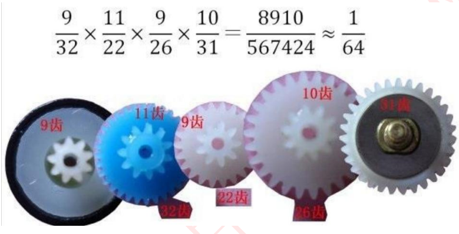

# AT89C58-Five-phase-Four-step-Stepper-Motor
由89C51控制的五线四项步进电机-28BYJ-48步进电机，其步进电机电机控制函数模块可移植其他单片机系统。
本程序中，控制步进电机28BYJ-48进行按照规定的方向、角度、速度进行转动，其功能函数名字为step_motor_28BYJ48_send_pulse()。
注！该函数控制转动下会有较小丢步，只能大致转动到对应角度，在精度不高的场合下可以使用。

# 基础知识与硬件设计

## 步进电机基础知识
### 步进电机内部构造


### 步进电机控制基本概念


### 步进电机28BYJ-48工作原理


### 步进电机的驱动拍数设定模式


### 28BYJ-48步进电机参数




### 28BYJ-48的驱动参数解读


## 驱动电路
由于驱动电流需要较大的灌电流，所以直接使用单片机的引脚无法直接驱动，于是选用ULN2003驱动电路来做电机驱动

### ULN2003驱动电路


### ULN2003驱动电路与单片机的接线


将单片机的P1.0、P1.1、P1.2、P1.3接到ULN2003驱动电路的IN1、IN2、IN3、IN4上。
当单片机的接口值为0的时候，对应IN的OUT将会为高电平5v。
当单片机的接口值为1的时候，对应IN的OUT将会为低电平0v。
除此之外，还需一个5v的接口接上我们的28BYJ-48步进电机的红线。
注！28BYJ-48步进电机的红线最高接上5V，如果低于5V也无法有足够的动力驱动转动电机内部的齿轮。

# 全部程序
此程序为测试程序，主要体现出电机控制子函数的功能。

```c
#include "reg52.h"

typedef unsigned int u16;	//对系统默认数据类型进行重定义
typedef unsigned char u8;

//定义ULN2003控制步进电机管脚
sbit IN1_A=P1^0;
sbit IN2_B=P1^1;
sbit IN3_C=P1^2;
sbit IN4_D=P1^3;

void delay_ms(u16 ms)
{
	u16 i,j;
	for(i=ms;i>0;i--)
		for(j=110;j>0;j--);
}

void step_motor_28BYJ48_send_pulse(u16 Direction ,u16 Angle ,u16 Speed)//Direction方向,Angle角度，Speed速度，
{
	u16 temp=(Angle/0.7);
	u16 i=0,j=0,c=0;
	
	for(j=0;j<temp;j++)
	{
		for(i=0;i<8;i++)
		{
			c=i;
			if(Direction==0)	//如果为逆时针旋转
				c=7-i;//调换节拍信号
			switch(c)//8个节拍控制：A->AB->B->BC->C->CD->D->DA
			{
				case 0: IN1_A=1;IN2_B=0;IN3_C=0;IN4_D=0;break;
				case 1: IN1_A=1;IN2_B=1;IN3_C=0;IN4_D=0;break;
				case 2: IN1_A=0;IN2_B=1;IN3_C=0;IN4_D=0;break;
				case 3: IN1_A=0;IN2_B=1;IN3_C=1;IN4_D=0;break;
				case 4: IN1_A=0;IN2_B=0;IN3_C=1;IN4_D=0;break;
				case 5: IN1_A=0;IN2_B=0;IN3_C=1;IN4_D=1;break;
				case 6: IN1_A=0;IN2_B=0;IN3_C=0;IN4_D=1;break;
				case 7: IN1_A=1;IN2_B=0;IN3_C=0;IN4_D=1;break;
				default: IN1_A=0;IN2_B=0;IN3_C=0;IN4_D=0;break;//停止相序	
			}
			delay_ms(Speed);
		}
	}
	
	IN1_A=0;IN2_B=0;IN3_C=0;IN4_D=0;//自动停止
}

void main()
{	
	//while(1)
	//{
		step_motor_28BYJ48_send_pulse(1,360,1);
	//}		
	while(1){;}
}
```

# 快速移植
可以直接移植的部分，对应硬件接口请对应该值
```c
typedef unsigned int u16;	//对系统默认数据类型进行重定义
typedef unsigned char u8;


//定义ULN2003控制步进电机管脚
sbit IN1_A=P1^0;
sbit IN2_B=P1^1;
sbit IN3_C=P1^2;
sbit IN4_D=P1^3;

void delay_ms(u16 ms)
{
	u16 i,j;
	for(i=ms;i>0;i--)
		for(j=110;j>0;j--);
}


void step_motor_28BYJ48_send_pulse(u16 Direction ,u16 Angle ,u16 Speed)//Direction方向,Angle角度，Speed速度，
{
	u16 temp=(Angle/0.7);
	u16 i=0,j=0,c=0;
	
	for(j=0;j<temp;j++)
	{
		for(i=0;i<8;i++)
		{
			c=i;
			if(Direction==0)	//如果为逆时针旋转
				c=7-i;//调换节拍信号
			switch(c)//8个节拍控制：A->AB->B->BC->C->CD->D->DA
			{
				case 0: IN1_A=1;IN2_B=0;IN3_C=0;IN4_D=0;break;
				case 1: IN1_A=1;IN2_B=1;IN3_C=0;IN4_D=0;break;
				case 2: IN1_A=0;IN2_B=1;IN3_C=0;IN4_D=0;break;
				case 3: IN1_A=0;IN2_B=1;IN3_C=1;IN4_D=0;break;
				case 4: IN1_A=0;IN2_B=0;IN3_C=1;IN4_D=0;break;
				case 5: IN1_A=0;IN2_B=0;IN3_C=1;IN4_D=1;break;
				case 6: IN1_A=0;IN2_B=0;IN3_C=0;IN4_D=1;break;
				case 7: IN1_A=1;IN2_B=0;IN3_C=0;IN4_D=1;break;
				default: IN1_A=0;IN2_B=0;IN3_C=0;IN4_D=0;break;//停止相序	
			}
			delay_ms(Speed);
		}
	}
	
	IN1_A=0;IN2_B=0;IN3_C=0;IN4_D=0;//自动停止
}
```

 # 主函数调用方法
在主函数中，直接调用 **step_motor_28BYJ48_send_pulse()** 这个子函数来控制步进电机，其中必须传入的参数为三个。
三个参数分别是 **Direction方向,Angle角度，Speed速度**。
参数中，Direction方向为1时候，为正转。为0的时候为反转。
Angle角度为标准°，例如 **90** 为旋转90度。
Speed速度范围为1-5，数值越大速度越慢。
下面以方向为正转，角度为360度，速度为最快1。
```c
void main()
{	
		step_motor_28BYJ48_send_pulse(1,360,1);	
	while(1){;}
}
```

# 注意！此函数控制步进电机的角度为大约值，是不准确的，由于硬件和程序数据类型的各种原因，用此子程序控制步进电机会丢步，且误差较大。
